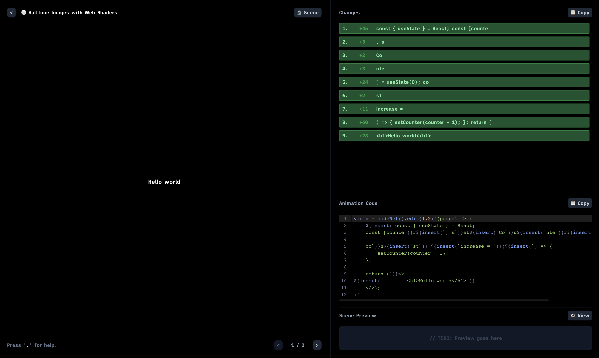

# ⚪ madewithcode (pre-pre-alpha)

> Warning:
> This project is still very much a work in progress. Do not expect everything to work as you may assume. If you have any questions, please feel free to reach out to me on [Twitter](https://twitter.com/designedcode).

This repository contains the source code for the daily explorations by [⚪ madewithcode](https://twitter.com/designedcode). Serving as a library of knowledge for developers to learn how to implement designs, the majority of content remains open-sourced and can be used anywhere in your projects.



Following a consistent template to make things easy, you can get up and running in just a few seconds. When learning how to implement design in a live project:

- 😡 Progress is slow and MUST be high-quality.
- 😭 Making small changes often has big consequences.
- 🚨 Your whole team needs to understand.

But, by learning with the help of the template you:

- 🪄 Can immediately get to the magic of making things look pleasing.
- ✅ Only have to run one command to have a Sandbox experience.
- 🧠 Have the ability to reference the things you learned in previous days.

## Getting Started

For so long, it has been difficult to find your place in the social sphere due to your lack of consistency but with an established framework you can extend the life-cycle of content while being able to produce a more vast set at fractions of the financial and capital cost. Built into this framework is a Sandbox that allows you to develop a single component in isolation that branches into multiple streams of content sources. Instead of having to spend hours writing code, recording footage, and editing videos, you can focus on the content and let the framework do the rest. **You can go from development to multiple sets of rendered video in under 30 minutes.**

The ⚪ madewithcode framework was designed with high-levels of opinion and was designed specifically for MY content creation pipeline. It may not fit your ideal workflow and that is okay. With this established though, the pipeline of development is:

- 📝 Write the React Typescript Scenes of your component.
- 🎥 Export the component and code animation renders.
- 🎬 Edit the video.
- 🎤 Export the voiceover.
- 📺 Export the final video(s).

> Warning:
> Although providing credit or including a tag is appreciated, it is not required. You can use this code as well as the built project at your free will and interest. Feel free to copy-paste as you please without concern of allegations of theft or litigation.

If you make improvements to the framework, please do submit a Pull Request so that everyone can benefit from your great work.

### Dependencies

The base of the framework has been built using:

- ⬆️ Vite (for application bundling)
- 👁️ React (for VDOM rendering)
- 🖼️ [Framer Motion](https://www.framer.com/motion/transition/) (for component animations)
- 💨 [Motion Canvas](https://motioncanvas.io/) (for code animations)

## The Sandbox

The Sandbox is the core of the framework. As the heart of the driving system, it visualizes and computes the code of your target video as you develop it. Instead of working for hours and then dreading an editing session, this pipeline takes care of doing so as the content is generated.

First, let's break the idea that the below steps are all separate. In reality, they are just the iteration of your process over time. Do not wait until the end and work in reverse. In this pipeline is effectively visual source control.

By default, when you create a new scene it will include some basic boilerplate. If you're ever lost just play around a little. It is really simple to understand once you see it live. With the basics already there you can follow along in place.

Now, important to note here that the Sandbox will give you all the final outputs needed to go to a video encoder. I did not go through the effort of building a video encoder into the framework because I wanted to give you the freedom to choose your own. I personally use [DaVinci Resolve](https://www.blackmagicdesign.com/products/davinciresolve/) but you can use whatever you want.

### Projects

At the core of the ⚪ madewithcode content is the idea that evergreen content has a long lifecycle not just in the social ecosystem, but in our personal development toolkit. Therefore, the Sandbox app has been developed in a way that enables the use of the same codebase for multiple projects. This allows for the reuse of code and the ability to reference previous projects in future projects.

To create a new project simply run and the generation script will take care of building the base for you:

```bash
npm run project
```

Instantly, you have a pre-configured project where you can write your Scenes with access to all the utilities that you have already developed.

### Scenes

Inside every project there is a set of scenes that are used to develop the larger piece of content. At the core, a scene is composed of several things but we can boil them down simply into two core pieces:

1. The configuration.
2. The component.

Inside the configuration we define values that control the visualization experience of this component. Then, as the component we declare a string representation of the active component so that the automatic interpolation between scenes can be calculated through `diff`.

To create a new scene simply run:

```bash
npm run scene
```

### Scene Example

This can seem overwhelming at the beginning so let me show you how simple it actually is. First, let's look at where we're going.

// TODO: Include the exported scene example here.

```tsx
(000).tsx;

import { Project } from "./types";

const project: Project = {
  name: "Day #000",
  description: "Establish the pipeline for ⚪ madewithcode.",
  width: 1080,
  height: 1920,
  framesPerSecond: 30,
  transitionDuration: 0.5,
  style: {
      backgroundColor: "transparent",
  }
  steps: [
    {
      duration: 1.2,
      code: `(props) => {
    return (<>
        <h1>Hello</h1>
    </>);
}`,
    },
    {
      duration: 1.2,
      code: `(props) => {
    return (<>
        <h1>Goodbye</h1>
    </>);
}`,
    },
  ],
};

export default project;
```

With just the simple configuration, you can create a solid video fit for your brand in just a couple of minutes.
